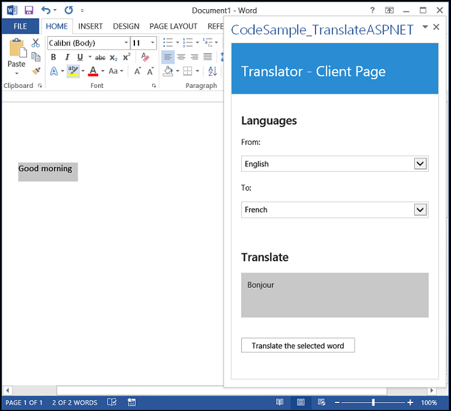

# Office Add-in - Use Bing Translator and ASP.NET in an add-in

**Table of contents**

* [Summary](#summary)
* [Prerequisites](#prerequisites)
* [Key components of the sample](#components)
* [Description of the code](#codedescription)
* [Build and debug](#build)
* [Troubleshooting](#troubleshooting)
* [Questions and comments](#questions)
* [Additional resources](#additional-resources)

## Summary

This sample translates the currently selected text in a Word or Excel file into the specified language using the Microsoft Translator service.

This add-in gets the current selection from the Office document and then sends it to the Bing Translator service for a translation into the specified language.

## Prerequisites
This sample requires the following:  

  - Visual Studio 2013 with Update 5 or Visual Studio 2015.
  - A subscription to the [Microsoft Translator API on Azure Marketplace](https://datamarket.azure.com/dataset/1899a118-d202-492c-aa16-ba21c33c06cb).
  - Word 2013 or later
  - Internet Explorer 9 or later, which must be installed but doesn't have to be the default browser. To support Office Add-ins, the Office client that acts as host uses browser components that are part of Internet Explorer 9 or later.
  - One of the following as the default browser: Internet Explorer 9, Safari 5.0.6, Firefox 5, Chrome 13, or a later version of one of these browsers.
  - Familiarity with JavaScript programming and web services.

## Key components

* CodeSample_TranslateASPNET project
	* [CodeSample_TranslateASPNET.xml](https://github.com/OfficeDev/Office-Add-in-TranslateASPNET/blob/master/C%23/CodeSample_TranslateASPNET/CodeSample_TranslateASPNETManifest/CodeSample_TranslateASPNET.xml) manifest file
* CodeSample_TranslateASPNETWeb project
	* [Home.html](https://github.com/OfficeDev/Office-Add-in-TranslateASPNET/blob/master/C%23/CodeSample_TranslateASPNETWeb/App/Home/Home.html). It contains the HTML control for the add-in's user interface.
	* [Home.js](https://github.com/OfficeDev/Office-Add-in-TranslateASPNET/blob/master/C%23/CodeSample_TranslateASPNETWeb/App/Home/Home.js). It contains the event handler for the Office.initialize event of the add-in, handles the button click event for the add-in's button, calls the ASP.NET web service, parses the response, and updates the UI with the output.
	* [Translate.asmx.cs](https://github.com/OfficeDev/Office-Add-in-TranslateASPNET/blob/master/C%23/CodeSample_TranslateASPNETWeb/App/Translate.asmx.cs). It defines the web service that handles the HTTP request from the add-in, stores the developer's client ID and client secret, and sends translation requests to the Microsoft Translator service.
	* [AdminAccess.cs](). It contains the **AdmAuthentication** and **AdmAccess** classes that update the access token for the server to communicate with the Microsoft Translator service.

## Description of the code

The sample demonstrates two specific techniques: how to add an ASP.NET web service to an Office Add-in and how to use the Microsoft Translator service. The ASP.NET web service in the solution stores the clientID and clientSecret parameters that the Microsoft Translator service requires to obtain an access token (which, in turn, is required for calling the Microsoft Translator service for a translation).

The Translate.asmx file in the code sample handles HTTP requests coming from the add-in, sends the translation request to the Microsoft Translator service, and then returns the results to the add-in. The AdminAccess.cs file in the App_Code folder handles the access tokens returned from the Microsoft Translator service.

## Build and debug

1.	To configure the Translator app, get a client ID and client secret from the [Azure DataMarket](https://datamarket.azure.com/dataset/1899a118-d202-492c-aa16-ba21c33c06cb). For more information, see [Obtaining an Access Token](http://msdn.microsoft.com/library/hh454950.aspx).
2.	Replace the default values for **clientID** and **clientSecret** in the [Translate.asmx.cs](https://github.com/OfficeDev/Office-Add-in-TranslateASPNET/blob/master/C%23/CodeSample_TranslateASPNETWeb/App/Translate.asmx.cs) file with your own values.
3.	Open the CodeSample_TranslateASPNET.sln file in Visual Studio.
4.	Set the **Start Document** property of the CodeSample_TranslateASPNETWeb project to either **New Excel Workbook** or **New Word Document**. 
5.	Press F5 to build and deploy the sample add-in Excel or Word.
6.	On the **Home** ribbon, click **Open** in the **Translator** group.
6.	Type text in a cell of the new Excel workbook or in the new Word document. Select the text.
7.	Select your **From** and **To** languages, and then press the **Translate the selected word** button.

## Troubleshooting

- If the **Translator** group does not appear on the **Home** ribbon, choose **Insert > My Add-ins >  CodeSample_TranslateASPNET**.
- If the app raises a "400: Bad request" exception, ensure that you have replaced the constants in the **Translate.asmx.cs** file with your own client ID and client secret values. Also, ensure that the HTTP request to the Microsoft Translator service has an Authorization header with a value set to **Bearer**, a space, and a current access token for the Microsoft Translator service.

## Questions and comments

- If you have any trouble running this sample, please [log an issue](https://github.com/OfficeDev/Office-Add-in-TranslateASPNET/issues).
- Questions about Office Add-ins development in general should be posted to [Stack Overflow](http://stackoverflow.com/questions/tagged/office-addins). Make sure that your questions or comments are tagged with [office-addins].

## Additional resources ##

- [More Add-in samples](https://github.com/OfficeDev?utf8=%E2%9C%93&query=-Add-in)
- [Office Add-ins](http://msdn.microsoft.com/library/office/jj220060.aspx)
- [Anatomy of an Add-in](https://msdn.microsoft.com/library/office/jj220082.aspx#StartBuildingApps_AnatomyofApp)
- [Creating an Office add-in with Visual Studio](https://msdn.microsoft.com/library/office/fp179827.aspx#Tools_CreatingWithVS)
- [Translate method](https://msdn.microsoft.com/library/ff512421.aspx).
- [HttpUtility.ParseQueryString method](https://msdn.microsoft.com/library/ms150046.aspx).
- [XMLHttpRequest object](https://msdn.microsoft.com/library/ms535874(v=vs.85).aspx).
- [Read and write data to the active selection in a document or spreadsheet](https://msdn.microsoft.com/library/office/fp123513.aspx).

## Copyright
Copyright (c) 2015 Microsoft. All rights reserved.

This project has adopted the [Microsoft Open Source Code of Conduct](https://opensource.microsoft.com/codeofconduct/). For more information, see the [Code of Conduct FAQ](https://opensource.microsoft.com/codeofconduct/faq/) or contact [opencode@microsoft.com](mailto:opencode@microsoft.com) with any additional questions or comments.
